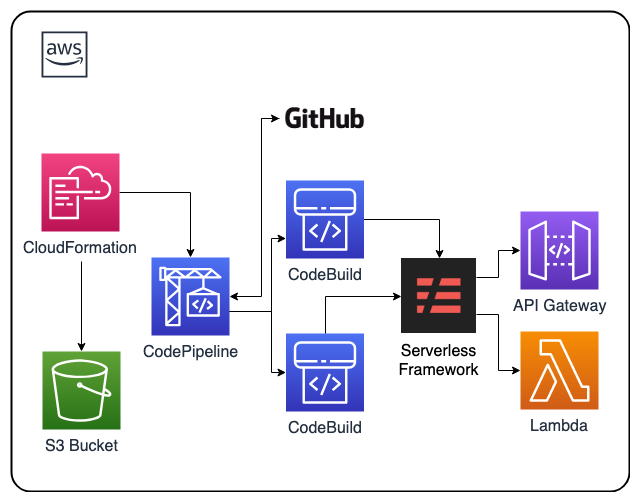

# aws-serverless-code-pipeline-cf-template

AWS CloudFormation template creating CodePipeline, CodeBuild supporting Serverless Framework and GitHub

## Description

This <a href="https://aws.amazon.com/cloudformation/" target="_blank">AWS CloudFormation</a> DevOps solution deploys <a href="https://aws.amazon.com/codepipeline/" target="_blank">AWS CodePipeline</a> to support <a href="https://serverless.com" target="_blank"> Serverless Open Source Framework</a> deployments that are triggered by <a href="https://github.com" target="_blank">GitHub</a> repository commits. As part of AWS CodePipeline <a href="https://aws.amazon.com/codebuild" target="_blank">AWS CodeBuild</a> is leveraged to build and deploy the Serverless open source framework.

AWS CodePipeline is a fully managed continuous delivery service that helps you automate your release pipelines for fast and reliable application and infrastructure updates. CodePipeline automates the build, test, and deploy phases of your release process every time there is a code change, based on the release model you define.

Serverless Framework is a tool developers can leverage to build and deploy serverless applications and has over 6 million downloads. A single configuration file allows you to list your functions and define the endpoints that they’re subscribed to.

GitHub is a web-based hosting service for version control using Git.

AWS CloudFormation provides a common language for you to describe and provision all the infrastructure resources in your cloud environment.

## AWS Resource Costs

As with most AWS services you will incur costs for usage. For this CloudFormation template the resources that incur costs are as follows

* Pricing:
  * <a href="https://aws.amazon.com/s3/pricing/" target="_blank">S3 pricing</a>
  * <a href="https://aws.amazon.com/api-gateway/pricing/" target="_blank">API Gateway pricing</a>
  * <a href="https://aws.amazon.com/lambda/pricing/" target="_blank">Lambda pricing</a>
  * <a href="https://aws.amazon.com/codepipeline/pricing/" target="_blank">CodePipeline pricing</a>
  * <a href="https://aws.amazon.com/codebuild/pricing/" target="_blank">CodeBuild pricing</a>
  * <a href="https://github.com/pricing" target="_blank">GitHub pricing</a>

## Prerequisites

* <a href="https://aws.amazon.com" target="_blank"> Amazon Web Services Account</a>
  * For this example use us-west-1 if you want to use a different region change serverless.yml
* <a href="https://aws.amazon.com/iam/" target="_blank">IAM</a> User with the following permissions:
  * Administrator (This could be more specific if you need)
* <a href="https://serverless.com" target="_blank">Serverless Framework</a> installed for your project. This repository has a test example you can use.
* <a href="https://github.com/pricing" target="_blank">GitHub</a> account
* GitHub OAuth token for access to be used by AWS CodePipeline read this <a href="https://help.github.com/articles/creating-a-personal-access-token-for-the-command-line/" target="_blank">article</a> to see how.

## CloudFormation Template

* The CloudFormation Template is available on GitHub:
   * <a href="https://github.com/getcft/aws-serverless-code-pipeline-cf-template" target="_blank">aws-serverless-code-pipeline-cf-template</a>

* This CloudFormation creates CodePipeline and CodeBuild IAM policies and roles. It also creates the CodePipeline leveraging CodeBuild to build the Serverless Framework retrieving code from GitHub using an OAuth token for access to the repository. To store CodePipeline files this CloudFormation template will also create a S3 bucket.

## Files and their purposes

* index.js
  * A simple "Hello World" application written in Node and leveraging express.
* package.json
  * Node Module dependencies for the Hello World application.
* serverless.yml
  * The serverless framework file that defines AWS Lambda Functions and the events that trigger them along with any resources they require.
* buildspec-dev.yml ~ buildspec-stg.yml ~ buildspec-prod.yml
  * File or files CodeBuild reads to understand build commands and related settings. There are three representing typical DEV STAGE and PROD environments.
* deploy.sh
  * Instructions for AWS CodePipeline to deploy the chosen environment

## Deploy the CloudFormation Template

* AWS Management Console

   * Login to *AWS Management Console*
   * Launch under *CloudFormation* the *serverless-code-pipeline-cf-template.yml* (included in this repo)

* CloudFormation Fields:

  * Stack name (Enter a name to associate to your AWS CodePipeline)
  * CodePipelineBucketPrefix (Enter a name for the utility S3 bucket CodePipeline will use)
  * Environment (Choose dev stage or prod, this is an identifier associated to the buildspec files)
  * GitHubOAuthToken (In Github generate a OAuth token and use that here)
  * GitHubRepository (The source repo for the pipeline, you can use getcft/aws-serverless-code-pipeline-cf-template/master to test)
  * Don't forget to check the box "I acknowledge that AWS CloudFormation might create IAM resources with custom names."

## Results of the CloudFormation Template

In the *AWS Management Console* you should be able to *verify* the following have been created.

* Two IAM Roles one for CodePipeline and one for CodeBuild both with custom policies
* An S3 bucket where workflow files are stored
* AWS CodePipeline
  * One AWS CodeBuild project to package your application.
  * One AWS CodeBuild project to deploy a "Hello World" Serverless Express Node App (API Gateway and Lambda).

## Workflow

The workflow is as follows, the Github repo/branch you designated with your Serverless code will be sourced initially and upon commits, which then will trigger a AWS CodeBuild project that will package the code (you can add linting here), and send the result to another AWS CodeBuild project that will deploy the code using a deploy script.

If you used this repository as a test you can go to CloudFormation and see two templates one has "aws-serverless-express-application" in the name if you select it and look at the "Outputs" tab you will see "ServiceEndpoint" with a URL click on it and you will get a "Hello World!" message.

Anytime you commit code to the repo/branch you specified it will trigger a new build and deploy it. This will be more relevant when you use it for your own repo/branch and not the test one since you don't have access to commit to this repository.

